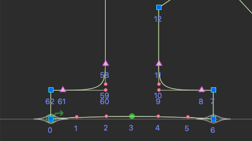
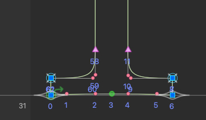

# Computer Modern Variable Process Log

### 19/12/2025 @ibo-o

- I made the /D/I/K/S/U/W/X/Y/Z compatible in Roman weight 400. The goal is to keep drawings as close as possible to the original sources. The process is mostly adding nodes where it's necessary while avoiding any distortion.

- For example if you need to add 61st and 8th nodes for a source that doesn't have those nodes. It's better to add them on top of 62nd and 7th.

- I removed some redundant nodes where it's possible.

- Tools I use to check & fix these interpolation issues: Robofont, Prepolator extension, Fontra

### 22/12/2025 @ibo-o

- I made /R/b/d/g/k/p/r/s/u/w/x/y/z interpolatable.

- Checking the design space file in Fontra is always helpful to spot which source is the problematic one. (Thanks to the bug icon)

- Then I go to those incompatible sources and check the point indexes in RoboFont.

### 23/12/2025 @ibo-o

- This letters are now fully compatible: /dotlessi/grave/acute/cedilla/germandbls/ae/oe/oslash/AE/OE/Oslash/suppress/exclam/numbersign/dollar/percent/ampersand/parenleft/parenright/asterisk/plus/comma/hyphen/period/zero/one/two/three/four/five/six/seven/eight/nine/colon/semicolon/exclamdown/equal/questiondown/question/at/M

### 24/12/2025 @ibo-o

- The sources are now compatible except these glyphs : /ff/fi/fl/ffi/ffl/arrowdown/arrowup/greater/less/quotesingle. As they are not present in some sources.