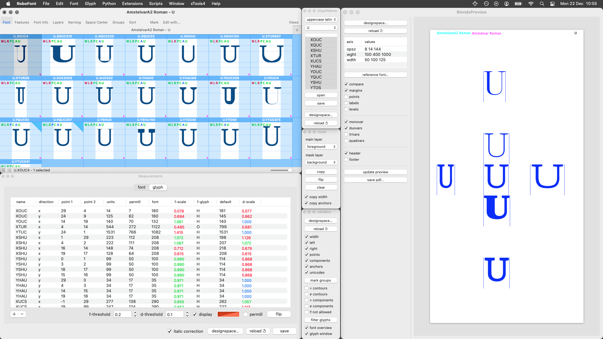
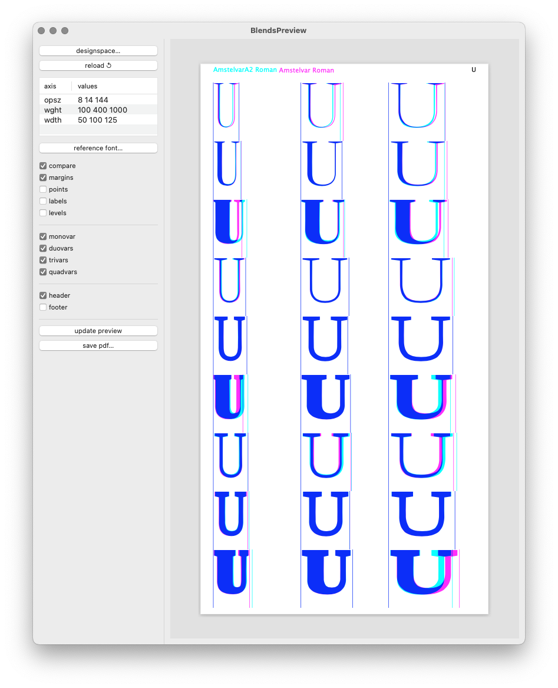
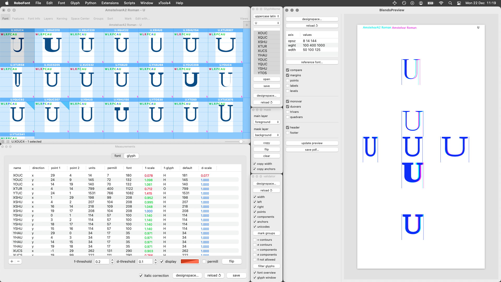
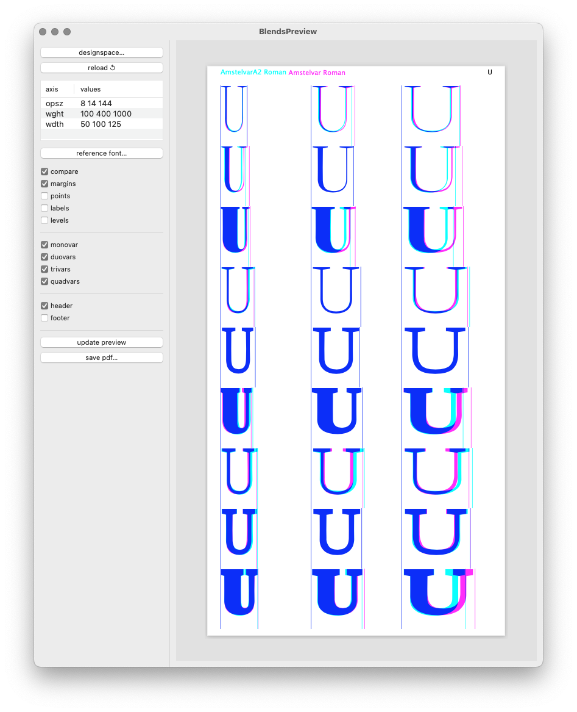
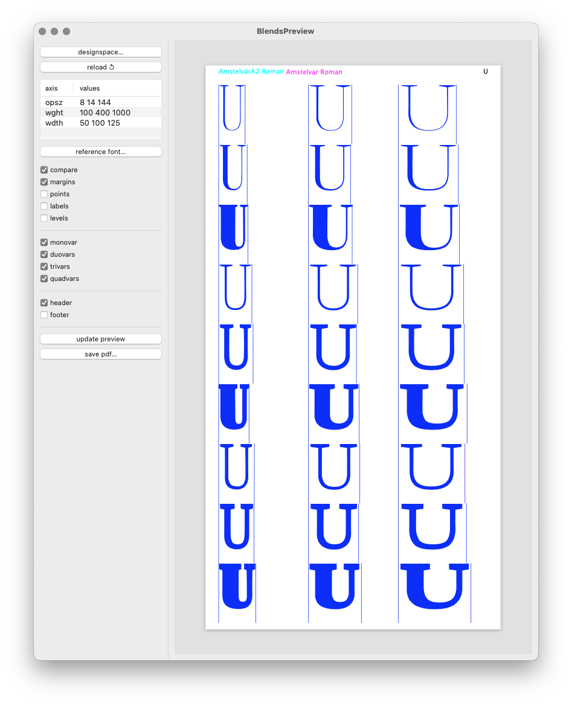
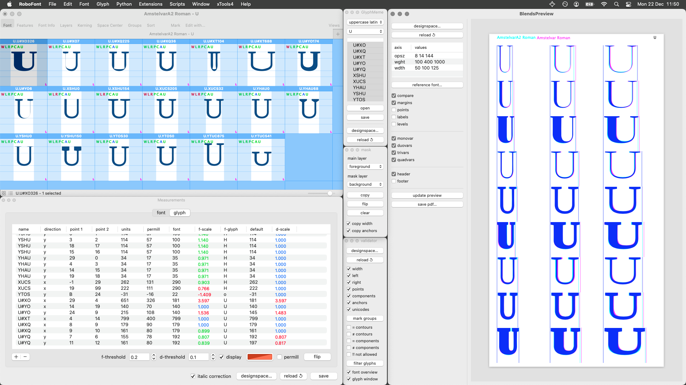
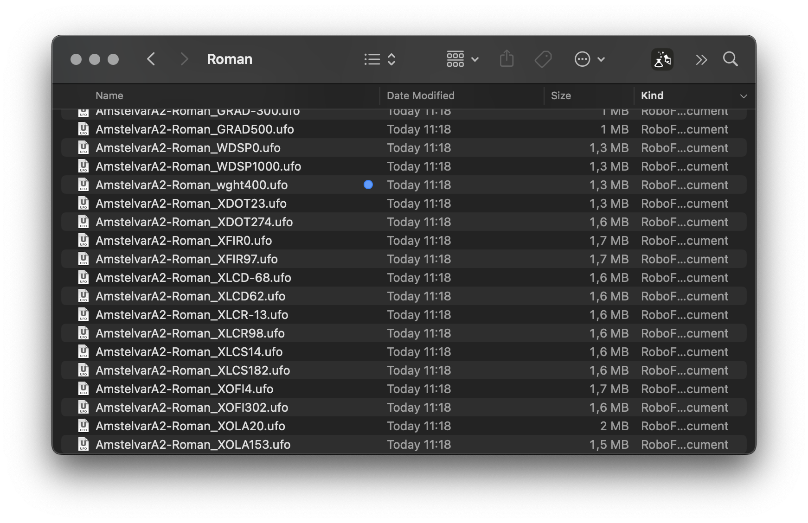
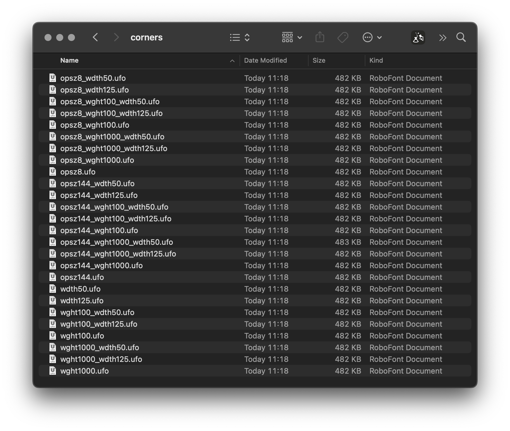

Parametric blending and corner tuning
=====================================

Amstelvar meta-research, December 2025

## Three different approaches to blending a full designspace

*in order of appearance*

### 1. Impure parametric sources (duovar tuned) + corner tuning for trivars, quadvars

branch: `impure-parametric` – [source](https://github.com/gferreira2/amstelvar-avar2/tree/impure-parametric)

*image 1.1. The “parametric impurity” can be seen in the Measurements shown for the selected temp glyph `/U.XOUC4` (bottom left) – not just XOUC, but several other parameters are also changing (red values). These “impurities” were introduced to make the duovar blends match the reference font (right side preview ).*

*image 1.2. The resulting designspace with matching parametric duovars, and no corner tuning for trivars and quadvars.*

*image 1.2. The corrected designspace with matching parametric duovars and corner tuning for trivars and quadvars.*

advantages:

- Roman UC & lc are mostly done
- duovar tuning participates in trivar and quadvar blending

disadvantages:

- if the sources are impure, the method is not really parametric!
- duovar tuning can be hard to predict due to scale factor

### 2. Pure parametric sources + corner tuning for duovars, trivars, quadvars

branch: `pure-parametric` – [source](http://github.com/gferreira2/amstelvar-avar2/tree/pure-parametric)

*image 2.1. The “parametric purity” can be seen in the Measurements shown for the selected temp glyph `/U.XOUC4` (bottom left) – only XOUC is changing while all other parameters stay the same (blue values). Because of this purity the duovar blends do not perfectly match the reference font (right side preview ).*

<!--

-->

*image 2.2. To match the reference font with precision, corner tuning sources are used to match duovars, trivars and quadvars separately.*

advantages:

- clear separation of concerns, easier to explain and to understand
- tuning with absolute deltas is faster (and possibly automatable)

disadvantages:

- lots of corner tuning sources
- corner tuning sources don’t participate in parametric matching (?)

### 3. Pure parametric sources + glyph-specific axes

branch: `glyph-axes` – [source](http://github.com/gferreira2/amstelvar-avar2/tree/glyph-axes)

*image 3.1. Glyph-specific measurements are added to control only this glyph, as seen in the Measurements shown for the selected glyph (bottom left). Using these dedicated axes it is possible to blend the reference font very closely (right side preview), but not perfectly.*

advantages:

- automated glyph-level font matching using measurements
- less manual tuning work (in theory)

disadvantages:

- too many axes, running out of meaningful 4-letter tags
- parametric sources are not sparse
- some manual tuning still required (is full parametrization possible?)

Summary
-------

### Two different kinds of sources

##### 1. Parametric sources

- influence all blended locations (by different amounts)
- deltas are scaled (harder to match)
- not sparse

##### 2. Corner tuning sources

- influence single blended locations (“point attractors”)
- deltas are absolute (easier to match)
- sparse

### Two ways to fine-tune blends

##### 1. corner tuning sources

- tuning with precision
- not used in parametric matching

##### 2. glyph-specific axes 

- insufficient by itself
- automated parametric matching
 